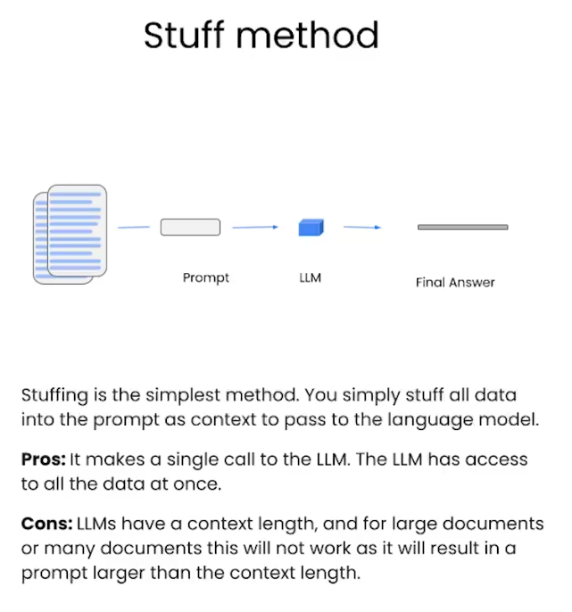

# LangChain: Q&A over Documents

An example might be a tool that would allow you to query a product catalog for items of interest.


```python
#pip install --upgrade langchain
```


```python
import os

from dotenv import load_dotenv, find_dotenv
_ = load_dotenv(find_dotenv()) # read local .env file
```


```python
#retrival over some doc
from langchain.chains import RetrievalQA
from langchain.chat_models import ChatOpenAI
from langchain.document_loaders import CSVLoader
# vector store in memory
from langchain.vectorstores import DocArrayInMemorySearch
from IPython.display import display, Markdown
```


```python
# load csv
file = 'OutdoorClothingCatalog_1000.csv'
loader = CSVLoader(file_path=file)
```


```python
# helps create vector store easyly
from langchain.indexes import VectorstoreIndexCreator
```


```python
#pip install docarray
```


```python
index = VectorstoreIndexCreator(
    vectorstore_cls=DocArrayInMemorySearch
).from_loaders([loader])
```


```python
query ="Please list all your shirts with sun protection \
in a table in markdown and summarize each one."
```


```python
response = index.query(query)
```


```python
display(Markdown(response))
```


| Name | Description |
| --- | --- |
| Men's Tropical Plaid Short-Sleeve Shirt | UPF 50+ rated, 100% polyester, wrinkle-resistant, front and back cape venting, two front bellows pockets |
| Men's Plaid Tropic Shirt, Short-Sleeve | UPF 50+ rated, 52% polyester and 48% nylon, machine washable and dryable, front and back cape venting, two front bellows pockets |
| Men's TropicVibe Shirt, Short-Sleeve | UPF 50+ rated, 71% Nylon, 29% Polyester, 100% Polyester knit mesh, machine wash and dry, front and back cape venting, two front bellows pockets |
| Sun Shield Shirt by | UPF 50+ rated, 78% nylon, 22% Lycra Xtra Life fiber, handwash, line dry, wicks moisture, fits comfortably over swimsuit, abrasion resistant |

All four shirts provide UPF 50+ sun protection, blocking 98% of the sun's harmful rays. The Men's Tropical Plaid Short-Sleeve Shirt is made of 100% polyester and is wrinkle-resistant

## Embeddings


## Vector Database


```python
loader = CSVLoader(file_path=file)
```


```python
docs = loader.load()
```


```python
docs[0]
```
OUT:

    Document(page_content=": 0\nname: Women's Campside Oxfords\ndescription: This ultracomfortable lace-to-toe Oxford boasts a super-soft canvas, thick cushioning, and quality construction for a broken-in feel from the first time you put them on. \n\nSize & Fit: Order regular shoe size. For half sizes not offered, order up to next whole size. \n\nSpecs: Approx. weight: 1 lb.1 oz. per pair. \n\nConstruction: Soft canvas material for a broken-in feel and look. Comfortable EVA innersole with Cleansport NXT® antimicrobial odor control. Vintage hunt, fish and camping motif on innersole. Moderate arch contour of innersole. EVA foam midsole for cushioning and support. Chain-tread-inspired molded rubber outsole with modified chain-tread pattern. Imported. \n\nQuestions? Please contact us for any inquiries.", metadata={'source': 'OutdoorClothingCatalog_1000.csv', 'row': 0})

## Embeddings
```python
from langchain.embeddings import OpenAIEmbeddings
embeddings = OpenAIEmbeddings()
```

```python
embed = embeddings.embed_query("Hi my name is Harrison")
```

```python
print(len(embed))
```

    1536


With all those numbers represents
```python
print(embed[:5])
```

    [-0.021913960576057434, 0.006774206645786762, -0.018190348520874977, -0.039148248732089996, -0.014089343138039112]


## Vector DB
```python
# Storing Embeddings to Vector Store
db = DocArrayInMemorySearch.from_documents(
    docs, 
    embeddings
)
```


```python
query = "Please suggest a shirt with sunblocking"
```

```python
docs = db.similarity_search(query)
```

```python
len(docs)
```
    4

```python
docs[0]
```

    Document(page_content=': 255\nname: Sun Shield Shirt by\ndescription: "Block the sun, not the fun – our high-performance sun shirt is guaranteed to protect from harmful UV rays. \n\nSize & Fit: Slightly Fitted: Softly shapes the body. Falls at hip.\n\nFabric & Care: 78% nylon, 22% Lycra Xtra Life fiber. UPF 50+ rated – the highest rated sun protection possible. Handwash, line dry.\n\nAdditional Features: Wicks moisture for quick-drying comfort. Fits comfortably over your favorite swimsuit. Abrasion resistant for season after season of wear. Imported.\n\nSun Protection That Won\'t Wear Off\nOur high-performance fabric provides SPF 50+ sun protection, blocking 98% of the sun\'s harmful rays. This fabric is recommended by The Skin Cancer Foundation as an effective UV protectant.', metadata={'source': 'OutdoorClothingCatalog_1000.csv', 'row': 255})


## Use This as Ques Answering 

```python
# takes a qury returns a doc. fetch doc
retriever = db.as_retriever()
```

```python
# as we want a natural language response. So LLM
llm = ChatOpenAI(temperature = 0.0)
```

```python
# combine the doc in a single text
qdocs = "".join([docs[i].page_content for i in range(len(docs))])

```

```python
# Get Response from LLM
response = llm.call_as_llm(f"{qdocs} Question: Please list all your \
shirts with sun protection in a table in markdown and summarize each one.") 

```
```python
display(Markdown(response))
```

| Name | Description |
| --- | --- |
| Sun Shield Shirt | High-performance sun shirt with UPF 50+ sun protection, moisture-wicking, and abrasion-resistant fabric. Recommended by The Skin Cancer Foundation. |
| Men's Plaid Tropic Shirt | Ultracomfortable shirt with UPF 50+ sun protection, wrinkle-free fabric, and front/back cape venting. Made with 52% polyester and 48% nylon. |
| Men's TropicVibe Shirt | Men's sun-protection shirt with built-in UPF 50+ and front/back cape venting. Made with 71% nylon and 29% polyester. |
| Men's Tropical Plaid Short-Sleeve Shirt | Lightest hot-weather shirt with UPF 50+ sun protection, front/back cape venting, and two front bellows pockets. Made with 100% polyester. |

All of these shirts provide UPF 50+ sun protection, blocking 98% of the sun's harmful rays. They also have additional features such as moisture-wicking, wrinkle-free fabric, and front/back cape venting for added comfort.


```python
# it does retrival and does ques ansering over the retrieved docu
qa_stuff = RetrievalQA.from_chain_type(
    llm=llm, # language model for text generation
    chain_type="stuff", # stuffs all the document into context. Makes one call to the language model. simplest
    retriever=retriever, # retriver we created above is just a interface for fetching document. It will be used for to fetch document an pass it to LLM
    verbose=True
)
```


```python
query =  "Please list all your shirts with sun protection in a table \
in markdown and summarize each one."
```


```python
response = qa_stuff.run(query)
```

    
    
    > Entering new RetrievalQA chain...
    
    > Finished chain.


```python
display(Markdown(response))
```


| Shirt Number | Name | Description |
| --- | --- | --- |
| 618 | Men's Tropical Plaid Short-Sleeve Shirt | This shirt is made of 100% polyester and is wrinkle-resistant. It has front and back cape venting that lets in cool breezes and two front bellows pockets. It is rated UPF 50+ for superior protection from the sun's UV rays. |
| 374 | Men's Plaid Tropic Shirt, Short-Sleeve | This shirt is made with 52% polyester and 48% nylon. It is machine washable and dryable. It has front and back cape venting, two front bellows pockets, and is rated to UPF 50+. |
| 535 | Men's TropicVibe Shirt, Short-Sleeve | This shirt is made of 71% Nylon and 29% Polyester. It has front and back cape venting that lets in cool breezes and two front bellows pockets. It is rated UPF 50+ for superior protection from the sun's UV rays. |
| 255 | Sun Shield Shirt | This shirt is made of 78% nylon and 22% Lycra Xtra Life fiber. It is handwashable and line dry. It is rated UPF 50+ for superior protection from the sun's UV rays. It is abrasion-resistant and wicks moisture for quick-drying comfort. |

The Men's Tropical Plaid Short-Sleeve Shirt is made of 100% polyester and is wrinkle-resistant. It has front and back cape venting that lets in cool breezes and two front bellows pockets. It is rated UPF 50+ for superior protection from the sun's UV rays.

The Men's Plaid Tropic Shirt, Short-Sleeve is made with 52% polyester and 48% nylon. It has front and back cape venting, two front bellows pockets, and is rated to UPF 50+.

The Men's TropicVibe Shirt, Short-Sleeve is made of 71% Nylon and 29% Polyester. It has front and back cape venting that lets in cool breezes and two front bellows pockets. It is rated UPF 50+ for superior protection from the sun's UV rays.

The Sun Shield Shirt is made of 78% nylon and 22% Lycra Xtra Life fiber. It is abrasion-resistant and wicks moisture for quick-drying comfort. It is rated UPF 50+ for superior protection from the sun's UV rays. It is handwashable and line dry.





```python
response = index.query(query, llm=llm)
```


```python
index = VectorstoreIndexCreator(
    vectorstore_cls=DocArrayInMemorySearch,
    embedding=embeddings,
).from_loaders([loader])
```


```python

```


```python

```


```python

```


```python

```


```python

```


```python

```
