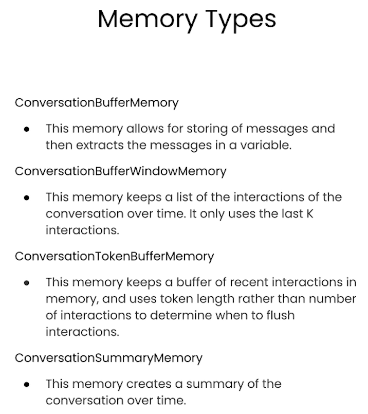
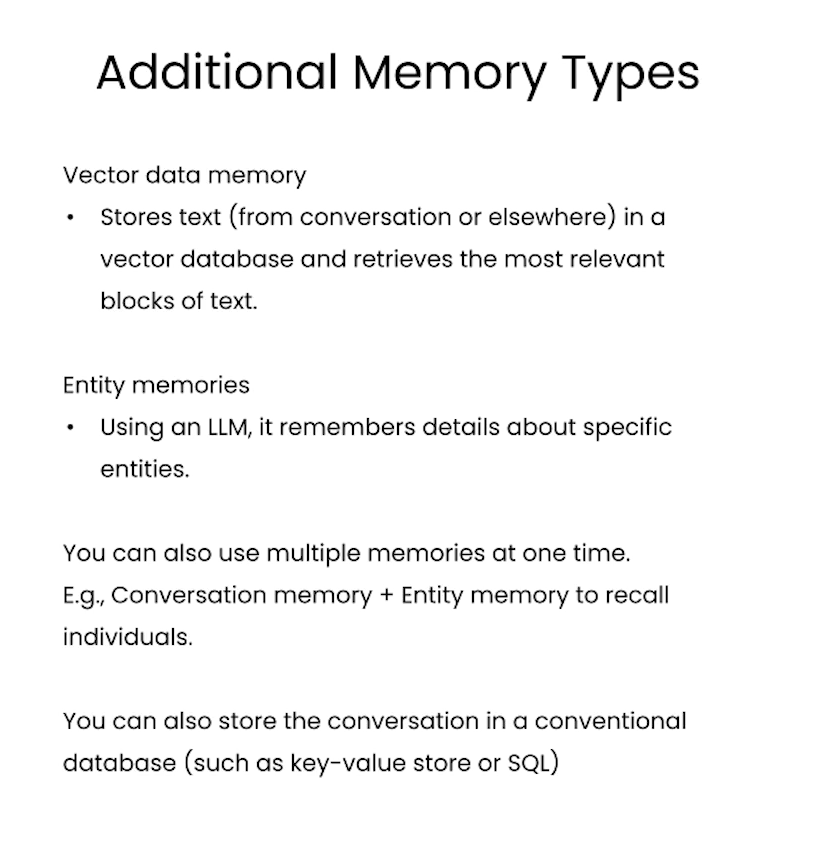

# Memory
How do you remember the previous parts of the conversation and feed that into the language model so they can have the conversational flow.

```
import os

from dotenv import load_dotenv, find_dotenv
_ = load_dotenv(find_dotenv()) # read local .env file

import warnings
warnings.filterwarnings('ignore')
```

```
from langchain.chat_models import ChatOpenAI
from langchain.chains import ConversationChain
from langchain.memory import ConversationBufferMemory
```
## ConversationBufferMemory
```
llm = ChatOpenAI(temperature=0.0)

memory = ConversationBufferMemory()

conversation = ConversationChain(
    llm=llm, 
    memory = memory,
    verbose=True
)
# verbose = False if you you dont want to know too many information.
```
#### Conversation
```
conversation.predict(input="Hi, my name is Andrew")
```
OUT: With verbose information

Entering new ConversationChain chain...
Prompt after formatting:
The following is a friendly conversation between a human and an AI. The AI is talkative and provides lots of specific details from its context. If the AI does not know the answer to a question, it truthfully says it does not know.

Current conversation:

Human: Hi, my name is Andrew
AI:

Finished chain.
"Hello Andrew, it's nice to meet you. My name is AI. How can I assist you today?"

```
conversation.predict(input="What is 1+1?")
```
OUT: 'The answer to 1+1 is 2.'

```
conversation.predict(input="What is my name?")
```
OUT: 'Your name is Andrew, as you mentioned earlier.'
-> The Ai remembers what is your name 

```
# It shows whats the conversation so far
print(memory.buffer)
```
OUT:

Human: Hi, my name is Andrew

AI: Hello Andrew, it's nice to meet you. My name is AI. How can I assist you today?

Human: What is 1+1?

AI: The answer to 1+1 is 2.
Human: What is my name?

AI: Your name is Andrew, as you mentioned earlier.

```
# shows history
memory.load_memory_variables({})
```
out:

{'history': "Human: Hi, my name is Andrew\nAI: Hello Andrew, it's nice to meet you. My name is AI. How can I assist you today?\nHuman: What is 1+1?\nAI: The answer to 1+1 is 2.\nHuman: What is my name?\nAI: Your name is Andrew, as you mentioned earlier."}

### Load additional data to AI if you want
```
memory = ConversationBufferMemory()
```

```
memory.save_context({"input": "Hi"}, 
                    {"output": "What's up"})
print(memory.buffer)
```
OUT:

Human: Hi
AI: What's up

```
memory.load_memory_variables({})
```
OUT:

{'history': "Human: Hi\nAI: What's up"}

```
memory.save_context({"input": "Not much, just hanging"}, 
                    {"output": "Cool"})

memory.load_memory_variables({})
```
OUT:

{'history': "Human: Hi\nAI: What's up\nHuman: Not much, just hanging\nAI: Cool"}

## ConversationBufferWindowMemory
```
from langchain.memory import ConversationBufferWindowMemory
```
```
# K is the number of conversation it remembers
memory = ConversationBufferWindowMemory(k=1)               
```
```
memory.save_context({"input": "Hi"},
                    {"output": "What's up"})

memory.save_context({"input": "Not much, just hanging"},
                    {"output": "Cool"})

```
```
memory.load_memory_variables({})
```
OUT:

{'history': 'Human: Not much, just hanging\nAI: Cool'}
llm = ChatOpenAI(temperature=0.0)

-> As K=1 it does not remember the first conversation

```
llm = ChatOpenAI(temperature=0.0)
memory = ConversationBufferWindowMemory(k=1)
conversation = ConversationChain(
    llm=llm, 
    memory = memory,
    verbose=False
)
```
```
conversation.predict(input="Hi, my name is Andrew")

conversation.predict(input="What is 1+1?")

conversation.predict(input="What is my name?")
```
OUT:

"I'm sorry, I don't have access to that information. Could you please tell me your name?"

-> As K=1 It does not remember the name

## ConversationTokenBufferMemory
```
#!pip install tiktoken
```
```
from langchain.memory import ConversationTokenBufferMemory
from langchain.llms import OpenAI

llm = ChatOpenAI(temperature=0.0)
```
```
memory = ConversationTokenBufferMemory(llm=llm, max_token_limit=30)

memory.save_context({"input": "AI is what?!"},
                    {"output": "Amazing!"})

memory.save_context({"input": "Backpropagation is what?"},
                    {"output": "Beautiful!"})

memory.save_context({"input": "Chatbots are what?"}, 
                    {"output": "Charming!"})
```
```
memory.load_memory_variables({})
```
OUT:

{'history': 'AI: Beautiful!\nHuman: Chatbots are what?\nAI: Charming!'}

-> As you can see the output is token limited.

## ConversationSummaryMemory
Summerizes the conversation to the tiken limit.
```
from langchain.memory import ConversationSummaryBufferMemory
```
```
# create a long string
schedule = "There is a meeting at 8am with your product team. \
You will need your powerpoint presentation prepared. \
9am-12pm have time to work on your LangChain \
project which will go quickly because Langchain is such a powerful tool. \
At Noon, lunch at the italian resturant with a customer who is driving \
from over an hour away to meet you to understand the latest in AI. \
Be sure to bring your laptop to show the latest LLM demo."

memory = ConversationSummaryBufferMemory(llm=llm, max_token_limit=100)

memory.save_context({"input": "Hello"}, {"output": "What's up"})

memory.save_context({"input": "Not much, just hanging"},
                    {"output": "Cool"})

memory.save_context({"input": "What is on the schedule today?"}, 
                    {"output": f"{schedule}"})
```
```
memory.load_memory_variables({})
```
OUT:

{'history': "System: The human and AI engage in small talk before discussing the day's schedule. The AI informs the human of a morning meeting with the product team, time to work on the LangChain project, and a lunch meeting with a customer interested in the latest AI developments."}

-> As you can see the whole conversation is not there just the summary

```
conversation = ConversationChain(
    llm=llm, 
    memory = memory,
    verbose=True
)
```

```
conversation.predict(input="What would be a good demo to show?")
```

Entering new ConversationChain chain...
Prompt after formatting:
The following is a friendly conversation between a human and an AI. The AI is talkative and provides lots of specific details from its context. If the AI does not know the answer to a question, it truthfully says it does not know.

Current conversation:
System: The human and AI engage in small talk before discussing the day's schedule. The AI informs the human of a morning meeting with the product team, time to work on the LangChain project, and a lunch meeting with a customer interested in the latest AI developments.
Human: What would be a good demo to show?
AI:

Finished chain.
"Based on the customer's interest in AI developments, I would suggest showcasing our latest natural language processing capabilities. We could demonstrate how our AI can accurately understand and respond to complex language queries, and even provide personalized recommendations based on the user's preferences. Additionally, we could highlight our AI's ability to learn and adapt over time, making it a valuable tool for businesses looking to improve their customer experience."

```
memory.load_memory_variables({})
```
OUT:\

{'history': "System: The human and AI engage in small talk before discussing the day's schedule. The AI informs the human of a morning meeting with the product team, time to work on the LangChain project, and a lunch meeting with a customer interested in the latest AI developments. **The human asks what would be a good demo to show.\n**AI: Based on the customer's interest in AI developments, I would suggest showcasing our latest natural language processing capabilities. We could demonstrate how our AI can accurately understand and respond to complex language queries, and even provide personalized recommendations based on the user's preferences. Additionally, we could highlight our AI's ability to learn and adapt over time, making it a valuable tool for businesses looking to improve their customer experience."}

-> As you can see that the prev question from human was added to the memory


