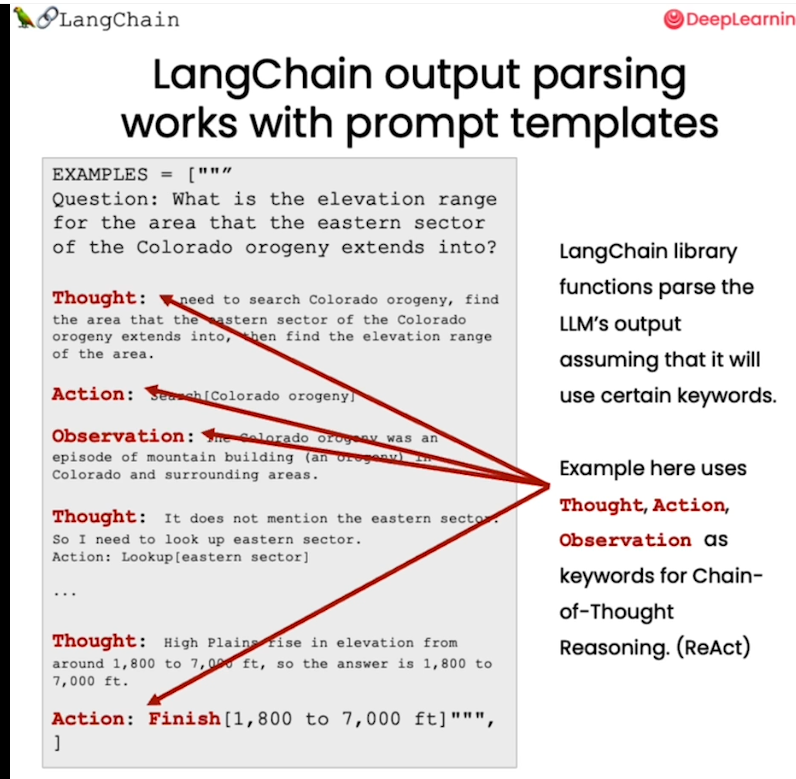
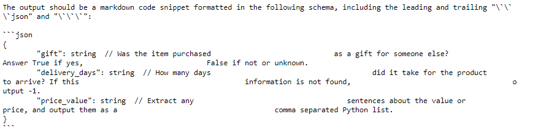
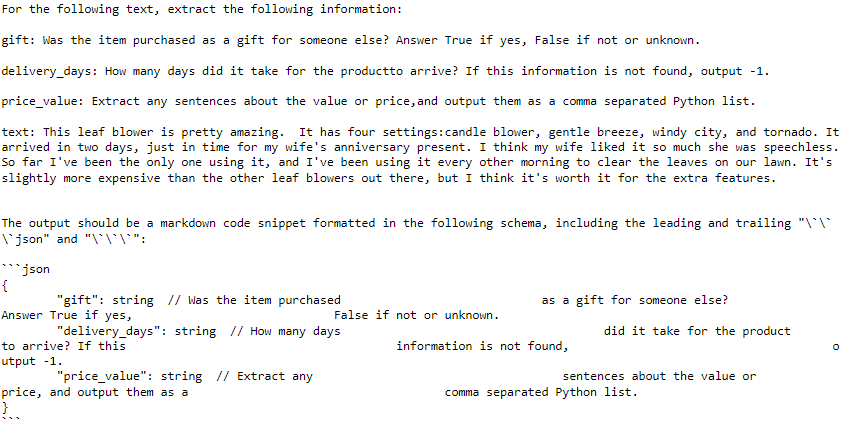
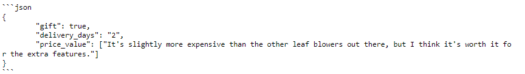

# Models, Prompts and Output Parsers

## Setup
```
def get_completion(prompt, model="gpt-3.5-turbo"):
    messages = [{"role": "user", "content": prompt}]
    response = openai.ChatCompletion.create(
        model=model,
        messages=messages,
        temperature=0, 
    )
    return response.choices[0].message["content"]

```
### Customer Chatbot
```
customer_email = """
Arrr, I be fuming that me blender lid \
flew off and splattered me kitchen walls \
with smoothie! And to make matters worse,\
the warranty don't cover the cost of \
cleaning up me kitchen. I need yer help \
right now, matey!
"""
```

```
style = """American English \
in a calm and respectful tone
"""
```

```
prompt = f"""Translate the text \
that is delimited by triple backticks 
into a style that is {style}.
text: ```{customer_email}```
"""

print(prompt)
```
OUt:
```
Translate the text that is delimited by triple backticks 
into a style that is American English in a calm and respectful tone
.
text: ```
Arrr, I be fuming that me blender lid flew off and splattered me kitchen walls with smoothie! And to make matters worse,the warranty don't cover the cost of cleaning up me kitchen. I need yer help right now, matey!
\```
```
```
response = get_completion(prompt)
response
```
OUT:'I am quite upset that my blender lid came off and caused my smoothie to splatter all over my kitchen walls. Additionally, the warranty does not cover the cost of cleaning up the mess. Would you be able to assist me, please? Thank you kindly.'

## Chat API : LangChain

Let's try how we can do the same using LangChain.

```python
#!pip install --upgrade langchain

from langchain.chat_models import ChatOpenAI
# To control the randomness and creativity of the generated
# text by an LLM, use temperature = 0.0
chat = ChatOpenAI(temperature=0.0)
chat
```
OUT:
```
ChatOpenAI(verbose=False, callbacks=None, callback_manager=None, client=<class 'openai.api_resources.chat_completion.ChatCompletion'>, model_name='gpt-3.5-turbo', temperature=0.0, model_kwargs={}, openai_api_key=None, openai_api_base=None, openai_organization=None, request_timeout=None, max_retries=6, streaming=False, n=1, max_tokens=None)
```

```
template_string = """Translate the text \
that is delimited by triple backticks \
into a style that is {style}. \
text: ```{text}```
"""
```
To Repeatedly reuse template - 
```
from langchain.prompts import ChatPromptTemplate

prompt_template = ChatPromptTemplate.from_template(template_string)

```

```
// the prompt
prompt_template.messages[0].prompt
```
OUT:
PromptTemplate(input_variables=['style', 'text'], output_parser=None, partial_variables={}, template='Translate the text that is delimited by triple backticks into a style that is {style}. text: ```{text}```\n', template_format='f-string', validate_template=True)

```
//To get the input variables
prompt_template.messages[0].prompt.input_variables
```

```python
customer_style = """American English \
in a calm and respectful tone
"""

customer_email = """
Arrr, I be fuming that me blender lid \
flew off and splattered me kitchen walls \
with smoothie! And to make matters worse, \
the warranty don't cover the cost of \
cleaning up me kitchen. I need yer help \
right now, matey!
"""
```

```python
# takes the tone/style and user text and formats it
customer_messages = prompt_template.format_messages(
                    style=customer_style,
                    text=customer_email)
```
```
print(type(customer_messages))
print(type(customer_messages[0]))
```
OUT:
<class 'list'>
<class 'langchain.schema.HumanMessage'>
```
print(customer_messages[0])
```
OUT:
content="Translate the text that is delimited by triple backticks into a style that is American English in a calm and respectful tone\n. text: ```\nArrr, I be fuming that me blender lid flew off and splattered me kitchen walls with smoothie! And to make matters worse, the warranty don't cover the cost of cleaning up me kitchen. I need yer help right now, matey!\n```\n" additional_kwargs={} example=False

```python
# Call the LLM to translate to the style of the customer message
customer_response = chat(customer_messages)
print(customer_response.content)
```
out: I'm really frustrated that my blender lid flew off and made a mess of my kitchen walls with smoothie. To add to my frustration, the warranty doesn't cover the cost of cleaning up my kitchen. Can you please help me out, friend?

```
service_reply = """Hey there customer, \
the warranty does not cover \
cleaning expenses for your kitchen \
because it's your fault that \
you misused your blender \
by forgetting to put the lid on before \
starting the blender. \
Tough luck! See ya!
"""
```
```
service_style_pirate = """\
a polite tone \
that speaks in English Pirate\
"""
```
```
service_messages = prompt_template.format_messages(
    style=service_style_pirate,
    text=service_reply)

print(service_messages[0].content)
```
OUT: Translate the text that is delimited by triple backticks into a style that is a polite tone that speaks in English Pirate. text: (```)Hey there customer, the warranty does not cover cleaning expenses for your kitchen because it's your fault that you misused your blender by forgetting to put the lid on before starting the blender. Tough luck! See ya!
(```)

```
service_response = chat(service_messages)
print(service_response.content)
```
out: Ahoy there, matey! I must kindly inform ye that the warranty be not coverin' the expenses o' cleaning yer galley, as 'tis yer own fault fer misusin' yer blender by forgettin' to put the lid on afore startin' it. Aye, tough luck! Farewell and may the winds be in yer favor!


## Output Parsers

Let's start with defining how we would like the LLM output to look like. The parser correctly interprets the output.



```
# Output should look like this
{
  "gift": False,
  "delivery_days": 5,
  "price_value": "pretty affordable!"
}
```

```
customer_review = """\
This leaf blower is pretty amazing.  It has four settings:\
candle blower, gentle breeze, windy city, and tornado. \
It arrived in two days, just in time for my wife's \
anniversary present. \
I think my wife liked it so much she was speechless. \
So far I've been the only one using it, and I've been \
using it every other morning to clear the leaves on our lawn. \
It's slightly more expensive than the other leaf blowers \
out there, but I think it's worth it for the extra features.
"""

# the following template gets the customer review formats it with define keys as JSON
review_template = """\
For the following text, extract the following information:

gift: Was the item purchased as a gift for someone else? \
Answer True if yes, False if not or unknown.

delivery_days: How many days did it take for the product \
to arrive? If this information is not found, output -1.

price_value: Extract any sentences about the value or price,\
and output them as a comma separated Python list.

Format the output as JSON with the following keys:
gift
delivery_days
price_value

text: {text}
"""
```

```
from langchain.prompts import ChatPromptTemplate

prompt_template = ChatPromptTemplate.from_template(review_template)
print(prompt_template)
```

```
messages = prompt_template.format_messages(text=customer_review)
chat = ChatOpenAI(temperature=0.0)
response = chat(messages)
print(response.content)
```

OUT:
```json
{
    "gift": true,
    "delivery_days": 2,
    "price_value": ["It's slightly more expensive than the other leaf blowers out there, but I think it's worth it for the extra features."]
}
```
Note: As the output comes out as string we cannot get the key:valute pairs from the dictionary. So we have to parse it

### Parse the LLM output string into a Python dictionary
```
from langchain.output_parsers import ResponseSchema
from langchain.output_parsers import StructuredOutputParser
```
```
# Creates formating instructions
gift_schema = ResponseSchema(name="gift",
                             description="Was the item purchased\
                             as a gift for someone else? \
                             Answer True if yes,\
                             False if not or unknown.")
delivery_days_schema = ResponseSchema(name="delivery_days",
                                      description="How many days\
                                      did it take for the product\
                                      to arrive? If this \
                                      information is not found,\
                                      output -1.")
price_value_schema = ResponseSchema(name="price_value",
                                    description="Extract any\
                                    sentences about the value or \
                                    price, and output them as a \
                                    comma separated Python list.")

response_schemas = [gift_schema, 
                    delivery_days_schema,
                    price_value_schema]
```
```
output_parser = StructuredOutputParser.from_response_schemas(response_schemas)

# gives you the prompt itself
format_instructions = output_parser.get_format_instructions()
print(format_instructions)
```
OUT:

```python
## review template improves the format instruction
review_template_2 = """\
For the following text, extract the following information:

gift: Was the item purchased as a gift for someone else? \
Answer True if yes, False if not or unknown.

delivery_days: How many days did it take for the product\
to arrive? If this information is not found, output -1.

price_value: Extract any sentences about the value or price,\
and output them as a comma separated Python list.

text: {text}

{format_instructions}
"""

prompt = ChatPromptTemplate.from_template(template=review_template_2)

messages = prompt.format_messages(text=customer_review, 
                                format_instructions=format_instructions)
```
```
print(messages[0].content)
```


```
response = chat(messages)
print(response.content)
```


```
# parse to dict
output_dict = output_parser.parse(response.content)
output_dict
```
OUT: 
{'gift': True,
 'delivery_days': '2',
 'price_value': ["It's slightly more expensive than the other leaf blowers out there, but I think it's worth it for the extra features."]}
```
type(output_dict) # dict
output_dict.get('delivery_days') # 2
```